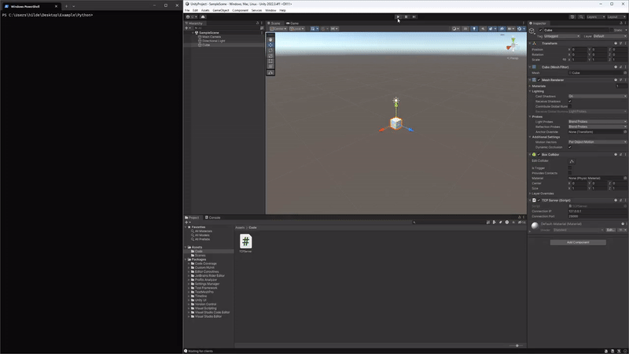
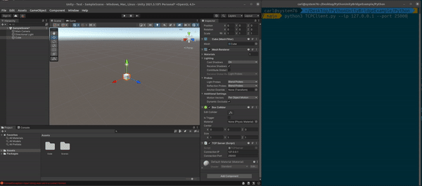
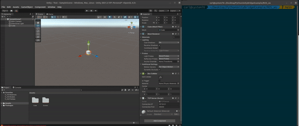

# Python Unity Bridge Example

This project provides an implementation of a TCP server in Unity3D and a TCP client in Python. The purpose of this system is to facilitate real-time control of Unity GameObjects from an external Python script.



## Description

The Unity TCP server attaches to a GameObject and listens for incoming connections. On the other side, the Python TCP client connects to the Unity server, sending a series of (x,y,z) coordinates and (x,y,z,w) quaternions. This data is then used to update the position and rotation of the GameObject in the Unity scene. The system can be used to programmatically control GameObjects for a wide variety of applications, such as simulations, AI training environments, robotics, and more.

This system is designed to be simple and flexible, capable of being extended for various use-cases. The Python client also includes features like variable send rates for tuning performance to match specific needs.

While the Unity server runs on a separate thread to keep the main game loop responsive, the Python client maintains a consistent update rate to ensure smooth GameObject movements. When a new position is received, the Unity server responds with an "Accepted" message, allowing for simple, reliable two-way communication. 

Please refer to the provided examples to understand how to use and implement this system in your own Unity projects. Feedback and contributions are welcomed!

## Unity Setup

You can either use the given Unity project or create a new 3D Unity project for the integration.

### Option 1: Importing the Provided Unity Project

Simply import the Unity project provided in this repository and you'll find the script "TCPServer.py" attached to a GameObject in the scene.

### Option 2: Creating a New 3D Unity Project

1. Create a new 3D Unity project.
2. Import the script `TCPServer.py` located in the `Unity` folder.
3. Attach the `TCPServer.py` script to any GameObject in your scene.

## Controlling GameObjects in Unity

You can control the position and rotation of GameObjects in Unity through two methods: using a basic Python script or a [ROS (Robot Operating System)](https://www.ros.org/) node. ROS is a middleware framework used to develop robotic applications, allowing for communication between various software components.

### Option 1: Using Basic Python Script

Load the Unity project and hit play. Then run the Python code in the `Python` folder using:
```bash
python3 TCPClient.py # For Ubuntu
python .\TCPClient.py # For Windows
```

The Python client will send a series of coordinates and quaternions to Unity, allowing you to control the GameObject's position and rotation.

The final result will look as follows:



### Option 2: Using ROS Node

Compile the ROS workspace in the `ROS_ws` folder using the following command:
```bash
cd ROS_ws
catkin_make # OR
catkin build
```

Next, run the code using the `unity_connection.launch`` file:
```bash
source devel/setup.bash
roslaunch ROS_ws unity_connection.launch topic:="/vicon/FDE2DO/FDE2D0"
```

This launch file will run the ROS node, enabling communication with Unity, and launch a bag file (which has recorded a topic `/vicon/FDE2DO/FDE2D0`) with a set of pre-recorded positions that will be forwarded to Unity, controlling the GameObject's position and rotation.

The final result will look as follows:



## Misc

Note: the default IP address is set to `127.0.0.1`. However, I have tested running the client and server on different machines within the same network. Just change the IP address in both the server and client script, and you will be good to go.

